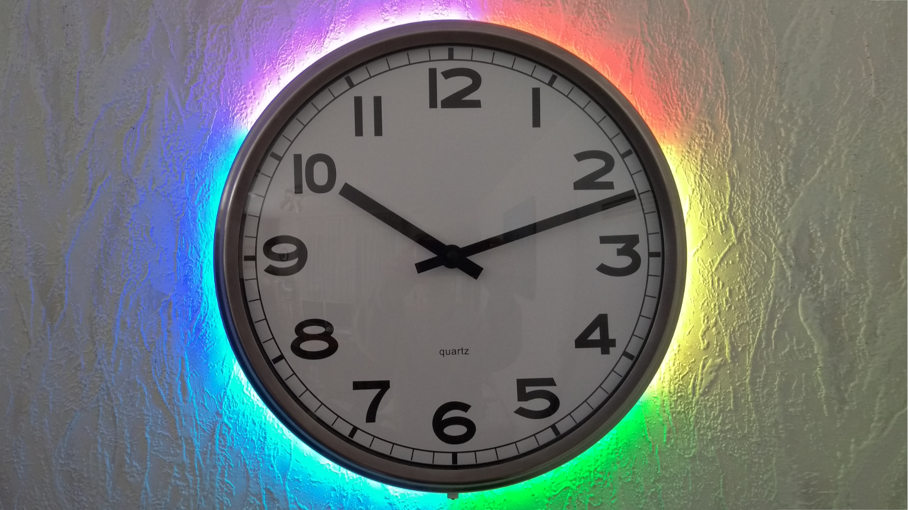
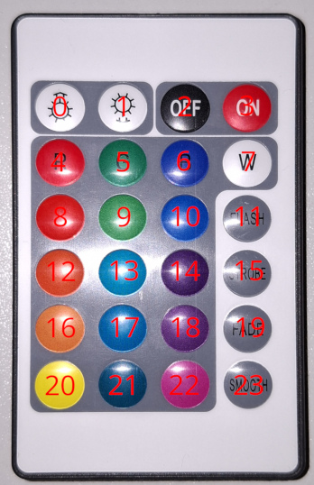

Maker Media GmbH
***

# IKEA-Uhr LEDifiziert

### Als hätte IKEA seine PUGG-Wanduhr dafür konstruiert, lässt sie sich ideal mit einem LED-Streifen nachrüsten. Von einem PICAXE-Mikrocontroller gesteuert, kann man mit den 60 LEDs tolle Lichtspiele für die Uhr programmieren und diese sogar fernsteuern.

Ergänzend zum Artikel aus der Make 7/23 findest du hier den benötigten Code für den PICAXE.



Den Artikel mit der Bauanleitung gibt es in der [Make-Ausgabe 7/23](https://www.heise.de/select/make/2023/7) zu lesen.
Inzwischen ist der Artikel auch bei [heise+](https://www.heise.de/ratgeber/Bastel-Projekt-Analoge-IKEA-Uhr-LEDifizieren-und-fernsteuern-9533477.html) erschienen.

## Meine Anmerkungen

### NEC IR-kompatible Fernbedienung

Zuerst habe ich eine Gigaset RC 20 benutzt.
Die Gigaset spricht allerdings kein NEC-kompatibles Protokoll.
Bei einem anderen LED-Band fand ich eine passende Fernbedienung.
Durch das Debugging habe ich die Codes der einzelnen Tasten identifiziert und auf das folgende Bild gezeichnet.



### Anpassungen im Code

Zunächst habe ich die Codes angepasst, damit sie zu dem Rest des Programs passen.

```Basic
#define IR_LEFT     0
#define IR_RIGHT    1
#define IR_0        2
#define IR_1        3
#define IR_2        4
#define IR_3        5
#define IR_4        6
#define IR_5        7
#define IR_6        8
#define IR_7        9
#define IR_8       10
#define IR_9       11
#define IR_PLAY    12
#define IR_STANDBY 13
#define IR_MENU    14
#define IR_RPT     15
#define IR_CH_M    16
#define IR_CH_P    17
#define IR_EQ      18
#define IR_VOL_DN  19
#define IR_VOL_UP  20
```

#### Todos

1. Aus meiner Sicht sollten die Konstanten umbenannt werden, damit sie die Tasten der Fernbedienung wiedergeben.
2. Weiter sind im Original-Programm nur 9 Animationen implementiert.
Es sind also noch genügend Programmplätze frei, um weitere Animationen zu implementieren.

### Verdrahtung des IR1261

Die drei Beinchen des IR1261 sind wie in folgender [Beschreibung](https://www.pollin.de/media/ea/0e/84/1701700447/D121152-D.pdf) zu verwenden.
Alternativ kann auch [VS1838B](https://elektro.turanis.de/html/prj296/index.html#vs1838b) als Referenz genutzt werden.
